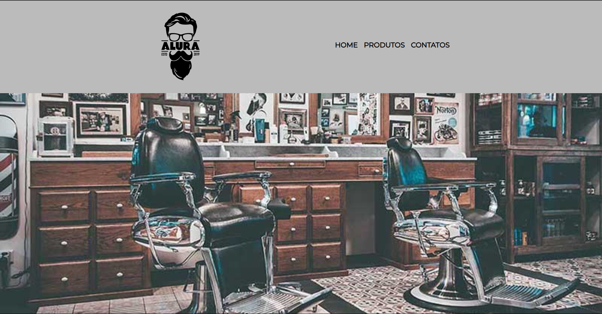

# Website para Barbearia

Este repositório contém um **website de uma barbearia**, desenvolvido durante o curso da [Alura](https://www.alura.com.br/). Hoje, olhando para ele, parece algo super simples, mas é engraçado lembrar que, na época, **meus amigos acharam incrível** e eu também estava muito orgulhoso! 😄

Foi também um marco importante na minha jornada: a **primeira vez que consumi uma API** — a do Google Maps! Na época, eu nem fazia ideia do que era uma API; só copiei e colei um pedaço de código. 😂 **Bons tempos!**

---

## Tecnologias Utilizadas

- **HTML5**
- **CSS3**
- **API do Google Maps**

---

## Objetivo do Projeto

- Praticar o desenvolvimento de websites completos com HTML e CSS.
- Aprender a adicionar funcionalidades externas (como o Google Maps).
- Criar um projeto com uma proposta realista, como um site comercial.

---

## Pré-visualização

  

---

📚 *Projeto desenvolvido como parte do aprendizado na Alura, repleto de boas lembranças!*
